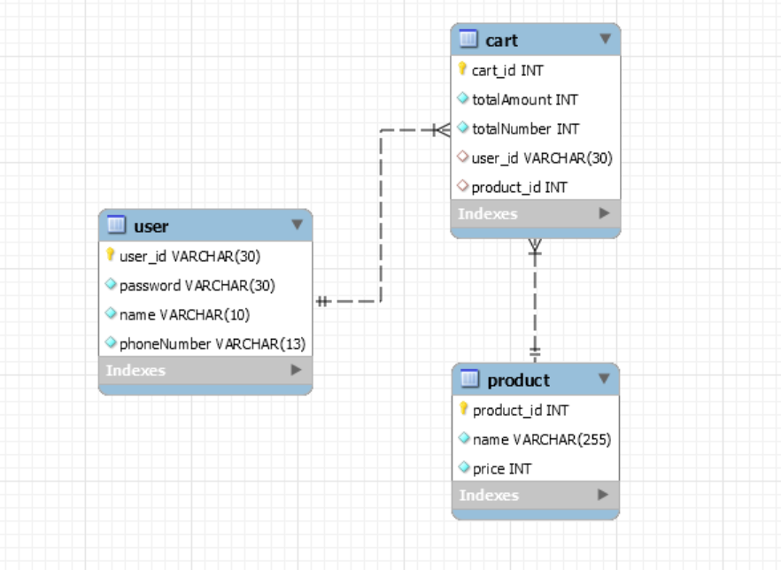

# 🛒E-commerce Project  

--- 
👩‍💻:  온라인 쇼핑몰에서 회원가입 후 상품을 검색, 장바구니에 담을 수 있는 프로그램입니다.

---

### < 프로젝트 기능 구현 >  
  

**1) 회원가입**  

- 회원가입을 하는 사용자는 USER 권한을 가진다. USER 권한을 가진 대상만 장바구니 기능에 접근할 수 있다.
- 회원가입 시 Id / Password / 이름 / 핸드폰번호 를 전달받는다.

**2) 로그인 / 로그아웃**  

- 로그인은 아이디 / 비밀번호가 일치해야 가능하다.
- 로그아웃은 로그아웃 url 에 접근하면 자동으로 실행된다.  -> "로그아웃 되었습니다"
- 로그아웃 시 장바구니는 비어있게 된다.

**3) 상품 등록 기능**  

- 상품 검색, 장바구니 기능 구현을 위해 상품 등록을 할 수 있게 한다.
- 상품 이름, 가격만 등록한다.

**4) 상품 검색 기능**  

- 상품명으로 원하는 상품을 검색할 수 있다. 
- 전체 이름을 검색하지 않아도 부분 상품명 검색이 가능하다.

**5) 장바구니 기능**  

- 상품 검색 후 원하는 상품을 나의 장바구니에 담을 수 있다.
- 장바구니에 담긴 상품을 삭제 할 수 있다.
- 장바구니에 담긴 상품의 총 금액 / 총 수량을 알 수 있다.
- 로그아웃 시 장바구니는 항상 비어있게 된다.

  

---

### < ERD >  

 

---

<h3> < STACKS > </h3>

 

 
   
  
  
   
  
  
  

   

